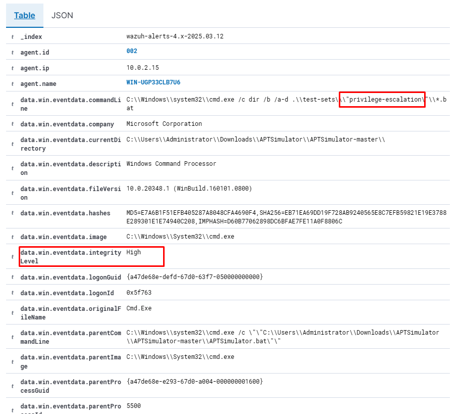
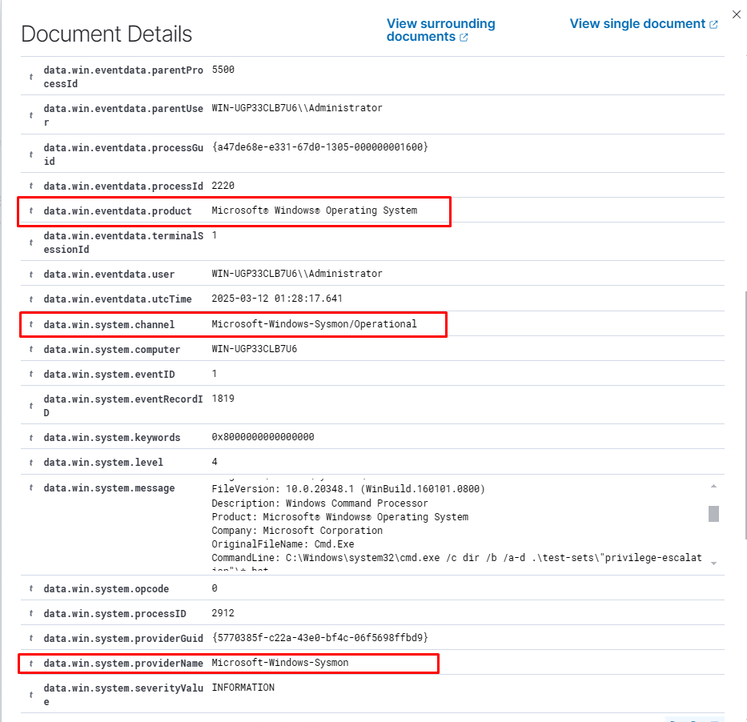

🛡️ InsiderShield: Threat Hunting & Resposta a Ameaças Internas com Wazuh

🚀 Monitoramento Avançado para Segurança Corporativa

🔍 Detecção de ameaças internas, movimentação lateral e abuso de privilégios em tempo real.

📌 Visão Geral

O InsiderShield é um projeto de Threat Hunting focado na detecção e resposta a ameaças internas dentro de um ambiente corporativo. Ele utiliza o Wazuh como SIEM, integrado a Sysmon e YARA, para fornecer uma análise detalhada dos eventos do sistema e detectar atividades maliciosas como:


```bash
📦 InsiderShield
 ┣ 📂 configs
 ┃ ┣ 📜 wazuh-rules.xml          # Regras customizadas para insider threats
 ┃ ┣ 📜 sysmonconfig-export.xml  # Configuração detalhada do Sysmon
 ┃ ┣ 📜 yara-rules.yar           # Regras YARA para detectar malware fileless
 ┣ 📂 dashboards
 ┃ ┣ 📜 kibana-dashboard.ndjson # Dashboard pronto para importação
 ┣ 📂 scripts
 ┃ ┣ 📜 auto-isolate.sh        # Script para isolar máquina comprometida
 ┃ ┣ 📜 yara-scan.ps1          # Rodar YARA na memória RAM
```

🛠️ Ferramentas Utilizadas
🔹 Wazuh	SIEM para monitoramento e resposta a incidentes

🔹 Sysmon	Coleta e análise detalhada de eventos no Windows

🔹 YARA	Regras para detecção de malware

🔹 ELK Stack (Kibana)	Visualização e análise dos alertas


Este projeto combina técnicas avançadas de detecção, correlação de eventos e automação de respostas para fortalecer a segurança corporativa.

🎯 Objetivos do Projeto
✔️ Criar um framework de Threat Hunting para detecção de ameaças internas

✔️ Implementar regras YARA para identificar malwares em tempo real

✔️ Automatizar respostas a incidentes, isolando máquinas comprometidas

📊 Monitoramento com Sysmon
O Sysmon permite capturar atividades detalhadas do sistema.

Instalação do malware para dectecção com o sysmon

```bash
> cd C:\Users\Administrator\Downloads

> Invoke-WebRequest -Uri https://github.com/NextronSystems/APTSimulator/archive/refs/heads/master.zip -OutFile APTSimulator.zip

>cd .\APTSimulator\APTSimulator-master\

> .\APTSimulator.bat

```



 (apt01)
(apt02)


📌 Exemplo de Detecção:

📌 Exemplo de Log Exportado:

```bash
{ 
  "event_id": "1", 
  "image": "C:\\Windows\\System32\\PING.EXE", 
  "command_line": C:\\Windows\\system32\\cmd.exe /c \"\"C:\\Users\\Administrator\\Downloads\\APTSimulator\\APTSimulator-master\\APTSimulator.bat\"\", 
  "user": "Administrator" 
  rule.mitre.id:T1087 T1059.003
}

```


📌 Arquivo de Configuração:
O Sysmon está configurado para capturar atividades maliciosas. Veja o arquivo de configuração completo aqui.


🔍 Detecção Avançada com YARA
Detecta demostra malwares utilizando recursos, a mesma é uma ferramenta de código aberto que identifica artefatos de malwares detectando artefatos em binarios. em comparativo com o VirusTotal o yara é a versão  100% gratuita, ou seja, o mesmo é detecção de malware ele é do virustotal porém seria a versão gratuita, ele funciona basicamente a mesma coisa há uma lista de keys que a comunidade fornece

 


Agora instalação de malware para validar o monitoramento do YARA.

```bash
 cd ~

> Invoke-WebRequest -Uri https://secure.eicar.org/eicar_com.zip -OutFile eicar.zip

> Expand-Archive .\eicar.zip

> cp .\eicar\eicar.com C:\Users\Administrator\Downloads

```

 


 


 


 
